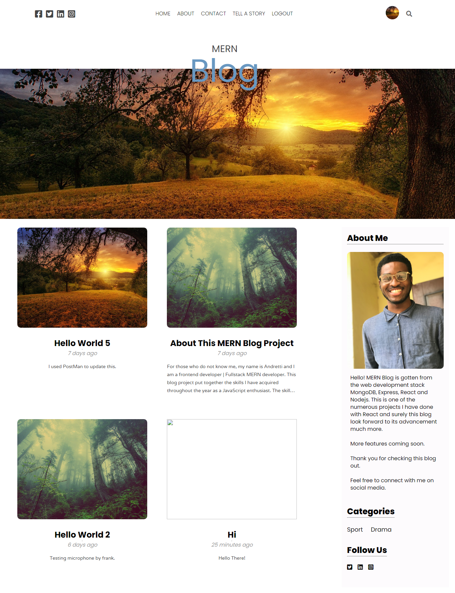
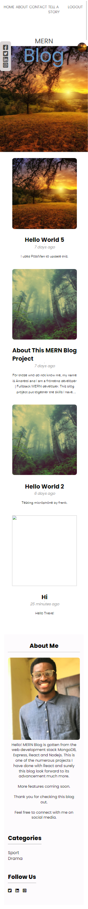

# MERN BLOG APPLICATION

This project is a full stack MERN Blog application with Context API that enables you to exchange unique details and assists in solving prop-drilling from all levels in this application.
An auth api was created using Nodejs to get users details so as to enable them to tell a story.

## Functionalities / Pages

👉 Register Page: This is where the user create an account in order to fully access the blog by posting.  
👉 Login Page: where the user login back to the site after logging out.  
👉 Home Page: This page is visible to everybody.  
👉 Story Page: This page takes in users inputs to as to render to a specific blog post and the homepage where every person can view it.  
👉 Articles Page: Posts are being fetched from the backend into this page.  
👉 Article Page: React is known for multiple usage of components throughout a webpage, the articles page passes data to the article page so as to view the article.  
👉 Setting Page: This is where users update their profile. That includes: profile image and password alone.  

See the previews of the homepage for both desktop and mobile views

Feel free to check the blog out in your local machine and do not hesitate to connect with me on

[Twitter](https://twitter.com/obubuoge)

[LinkedIn](https://linkedin.com/in/oge-obubu)

[My Website](https://ogeobubu.netlify.app)

## Fork this project

Feel free to enhance this project and make it yours.

After downloading the clone version, ensure you install all dependencies using

### `npm install` or `yarn add`

## Available Scripts

In the project directory, you can run:

### `yarn start`

Runs the app in the development mode.\
Open [http://localhost:3000](http://localhost:3000) to view it in the browser.

The page will reload if you make edits.\
You will also see any lint errors in the console.
